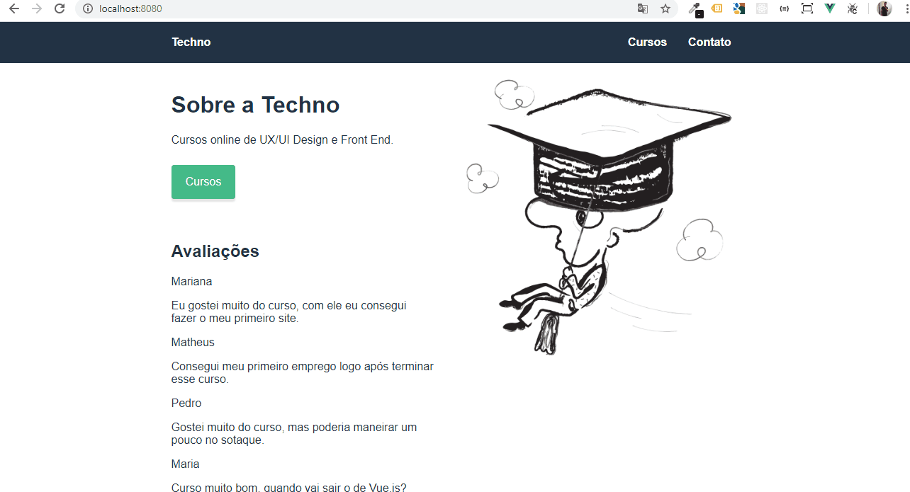

# Techno Cursos com VueJS

Projeto desenvolvido no curso de VueJS completo da Origamid, onde é aplicado os conceitos de Vue Router, SPA e API.

## Mais Info

- VueJS com SPA (Single Page Application);
- Simulado a API com o arquivo api.json, utilizando JSON Server em  https://github.com/typicode/json-server

## Funcionando

